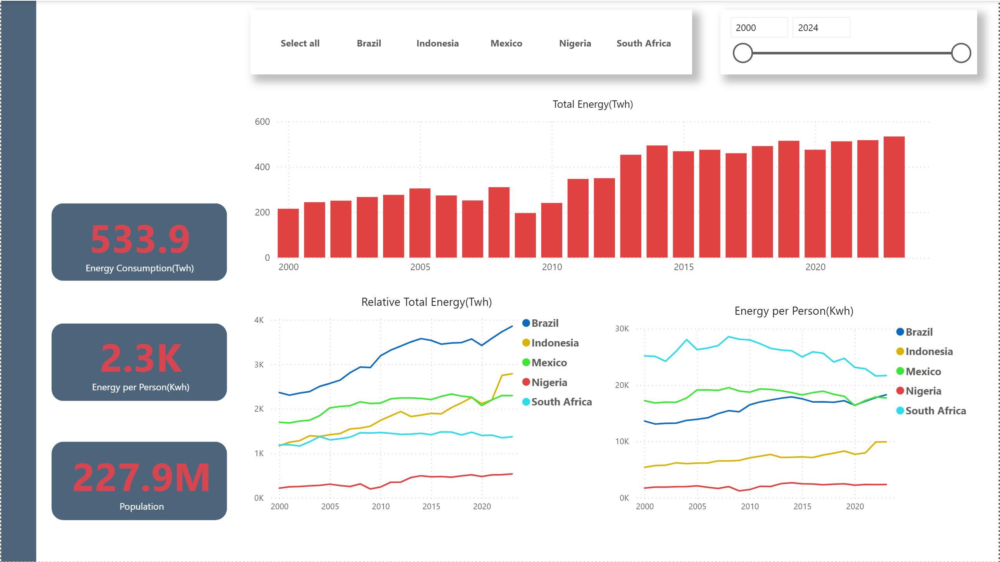
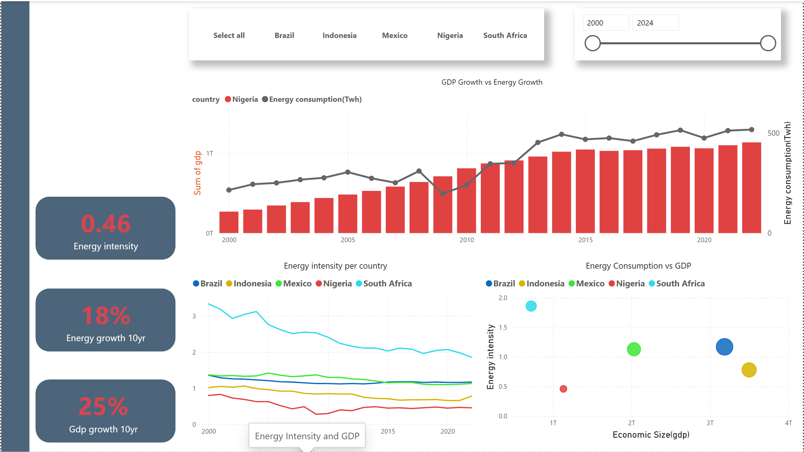
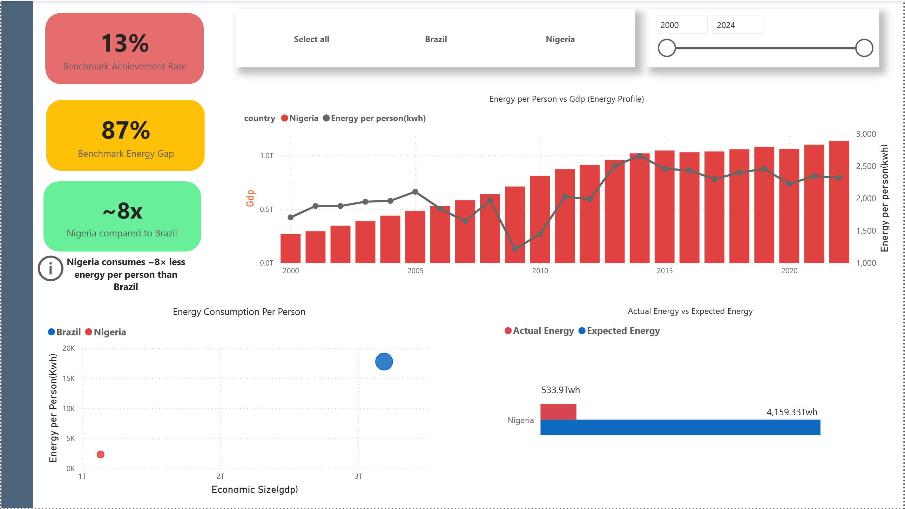

# 🇳🇬 Nigeria’s Structural Energy Deficit

## Comparative Analysis of Primary Energy Consumption and Economic Growth in Emerging Economies

---

##  Project Overview

Nigeria is one of the largest economies in Africa and a major oil and gas producer, yet its energy consumption per capita remains significantly lower than that of comparable emerging economies.

This project investigates **why Nigeria’s energy consumption remains low despite economic growth**, using data-driven analysis across five emerging economies:

- Nigeria 🇳🇬  
- South Africa 🇿🇦  
- Brazil 🇧🇷  
- Indonesia 🇮🇩  
- Mexico 🇲🇽  

The analysis focuses strictly on **non-electricity primary energy**, examining structural gaps in:

- Energy scale  
- Energy intensity    
- Comparative energy performance  

---

##  Key Research Questions

1. How does Nigeria’s primary energy consumption compare with peer emerging economies?  
2. Is Nigeria energy-efficient or energy-constrained relative to its GDP?  
3. Is energy growth keeping pace with pnopulation and economic expansion?  
4. What is the magnitude of Nigeria’s energy gap compared to similar economies?  

---

##  Core Insight (Executive Summary)

> Nigeria suffers from a structural energy deficit driven by low per-capita energy consumption, population-diluted growth, and weak alignment between energy use and economic expansion.

### Key Findings

- **Energy Scale Gap:** Nigeria’s energy consumption per capita is significantly lower than peer economies  
- **Population-Diluted Growth:** Total energy growth is offset by rapid population increase  
- **Energy Intensity Misinterpretation:** Low energy intensity reflects constrained energy usage — not efficiency  
- **Underpowered Economy:** Energy supply is insufficient to support industrial-scale growth  

---

##  Data Source

- **Our World in Data (OWID):** Energy & macroeconomic dataset  
- Time span: 2000 – 2024  

### Metrics Used

- Primary energy consumption  
- Energy per capita  
- Energy per GDP (energy intensity)  
- GDP  
- Population  

>  Note: Fuel-level and energy mix metrics were excluded due to inconsistent availability for Nigeria.

---

##  Technical Architecture

### ETL Pipeline
OWID Dataset → Python (Pandas) → PostgreSQL → SQL Views → Power BI Dashboard

---


### Tools & Technologies

- Python (Pandas, SQLAlchemy)  
- PostgreSQL  
- SQL (analytical views)  
- Power BI  
- Git & GitHub  

---

##  Data Model

### Core Table

- `fact_energy` (single-table modeling approach)

### Key Fields

- primary_energy_consumption  
- energy_per_capita  
- energy_per_gdp  
- gdp  
- population  
- country  
- year  

### Modeling Approach

- `v_` → Base view (cleaned, typed data)  
- `a_` → Analytical views (one per business question)  

---

## 📊 Dashboard Structure

| Page   | Focus                                   |
|--------|----------------------------------------|
| Page 1 | Primary energy consumption & per capita |
| Page 2 | Energy intensity vs GDP                 |
| Page 3 | Energy gap benchmarking                |

---

###  Page 1 — Energy Scale Gap

**Focus:** Total energy vs energy per capita  

**Insight:**  
Nigeria’s energy consumption grows slowly, but per-capita energy remains critically low.

---

###  Page 2 — Energy Intensity vs GDP

**Focus:** Efficiency vs economic scale  

**Insight:**  
Nigeria’s low energy intensity reflects **limited energy use**, not efficiency.


---

###  Page 3 — Nigeria Energy Gap Model

**Focus:** Expected vs actual energy consumption  

**Insight:**  

> Nigeria operates at ~13% of expected energy levels when benchmarked against peer economies.

---

##  Analytical Highlights

### Nigeria Energy Gap Model

This model estimates expected energy consumption using peer-country benchmarks.

**Example Insight:**

> If Nigeria had Brazil’s energy profile, energy consumption per capita would be **approximately 8** times higher than current levels.

---

##  Key Visuals

- GDP vs Energy Intensity (scatter plot)  
- Energy per capita comparison (line chart)  
- Energy intensity trend (line chart)  
- Expected vs actual energy consumption (gap model)  

---

##  How to Run This Project

1. Clone the repository  
2. Install dependencies:
   ```bash
   pip install -r requirements.txt
3. Run Python ETL scripts/notebooks
4. Load cleaned data into PostgreSQL
5. Execute SQL views in /sql
6. Open Power BI dashboard in /power BI

---

<pre> ```text energy-analysis/
│
├── data/
│   ├── raw/
│   └── processed/
│
├── notebooks/
│   └── 01_etl.ipynb
│
├── sql/
│   ├── v_base.sql
│   └── a_analytics.sql
│
├── dashboards/
│   ├── energy_dashboard.pbix
│   └── screenshots/
│
├── powerpoint/
│   └── powerpoint_slide.pptx
│
├── pictures/
│
├── README.md
├── requirements.txt
├── .gitignore
└── .env.example ``` </pre>

---

## Power BI Dashboard Preview

### Primary Energy Consumption Trends (2000–2024)

*Nigeria’s energy consumption grows slowly, but per-capita energy remains critically low.*

### Energy Intensity and GDP

*Nigeria’s low energy intensity reflects **limited energy use**, not efficiency.*

### Energy Gap

*Nigeria operates at ~13% of expected energy levels when benchmarked against peer economies.*

---

## Limitations

- Missing GDP data for some years
- Informal energy usage not captured
- National-level analysis only (no regional breakdown)
- Electricity reliability and outages not included

---

## Recommendations

- Scale total energy supply to match economic growth
- Track energy per capita as a core development metric
- Align energy expansion with industrial activity
- Adopt data-driven energy planning for infrastructure investment

---

##  References

- Our World in Data — Energy Dataset


---

## Author

**Suleiman Taiwo**
Energy Data Analyst | Data Engineering Enthusiast

Skills: Python, SQL, PostgreSQL, Power BI
Background: Electrical & Electronics Engineering

📍 Lagos, Nigeria  
📧 Email - Suleyimantaiwo@gmail.com
🌐 LinkedIn - https://www.linkedin.com/in/suleimantaiwo/
🖥 Portfolio Website - https://suleyimantaiwo.wixsite.com/portfolio


